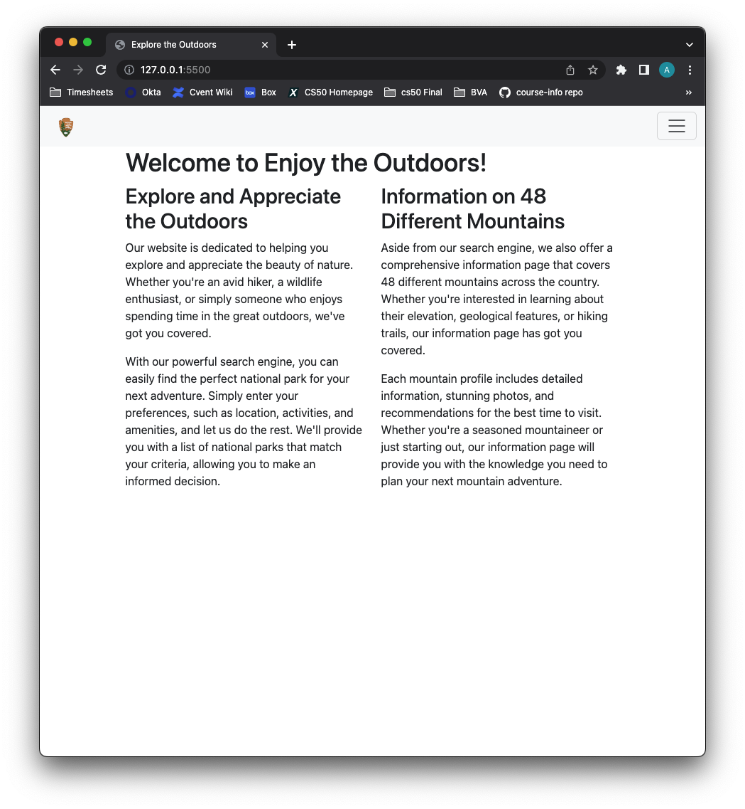
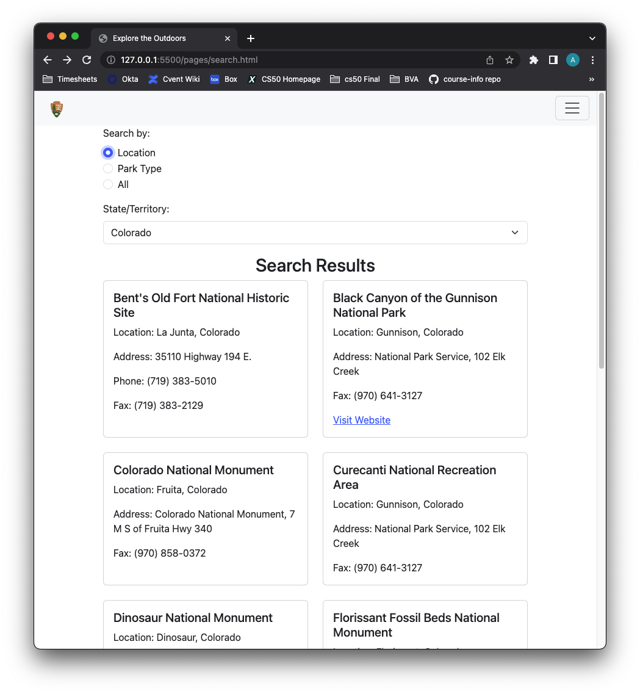
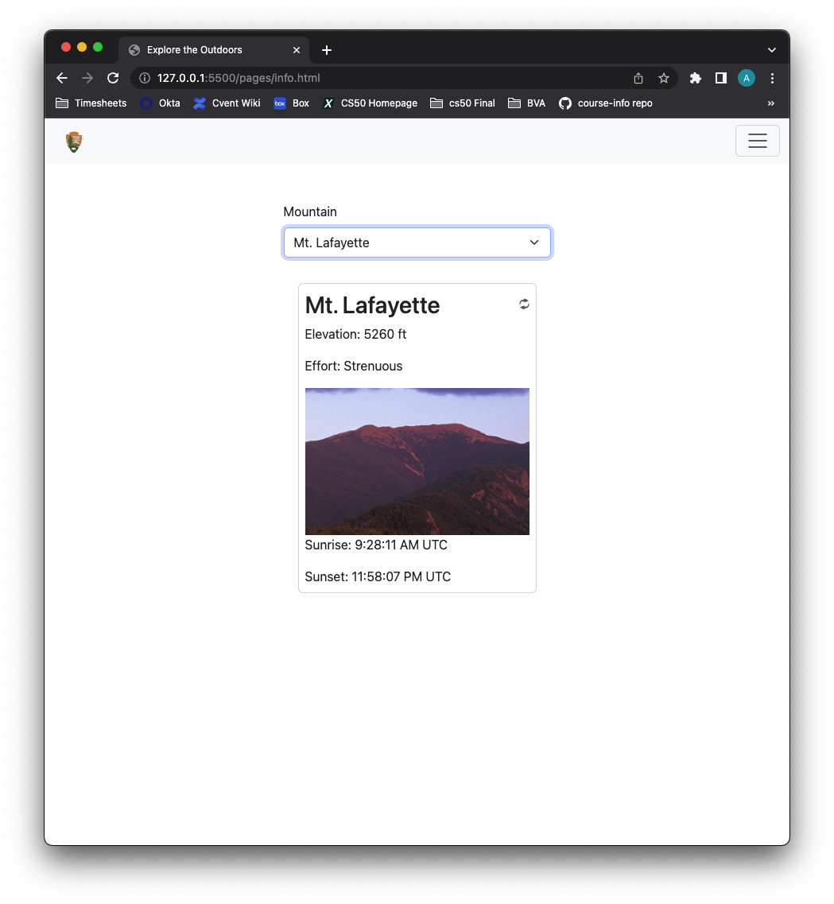

# Explore the Outdoors

This project is a web application that allows users to explore information about various mountains. It provides details such as the mountain's name, description, coordinates, elevation, effort required to climb, and the times of sunrise and sunset.

## Project Structure

- `assets/`: Contains all the static files used in the project.
    - `css/`: Contains the CSS files for styling the web pages.
    - `images/`: Contains the images used in the web pages.
    - `scripts/`: Contains the JavaScript files for the functionality of the web pages.
- `index.html`: The main landing page of the web application.
- `pages/`: Contains the additional web pages of the application.
    - `info.html`: The page that displays detailed information about a selected mountain.
    - `search.html`: The page that allows users to search for parks within the national park system.
- `README.md`: The file you're currently reading.

## Technologies Used

  
  
  
  

## Usage

## License

This project is licensed under the terms of the MIT License. See the [full license text](https://opensource.org/licenses/MIT) for details.

## Contact

[Andrew Muhn](https://github.com/andrewmuhn)  
